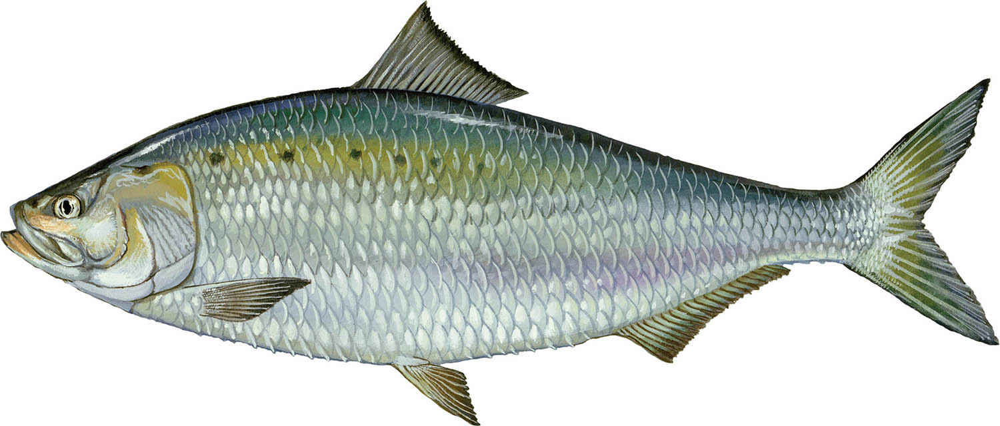

# American shad Reference Genome

This repository contains the scripts used to analyze the American shad (Alosa sapidissima) reference genome assembly fAloSap1.pri.
 

  

   

## Analysis  

* [**Genome-wide Coverage and Heterozygosity**](https://github.com/therkildsen-lab/shad-genome/blob/main/markdowns/coverage_heterozgosity.md)  
* **PSMC**  
* [**Repetitive Regions**](https://github.com/therkildsen-lab/shad-genome/blob/main/markdowns/repetitive_regions.md)
* [**Circos Plot**](https://github.com/therkildsen-lab/shad-genome/blob/main/markdowns/synteny.md)

