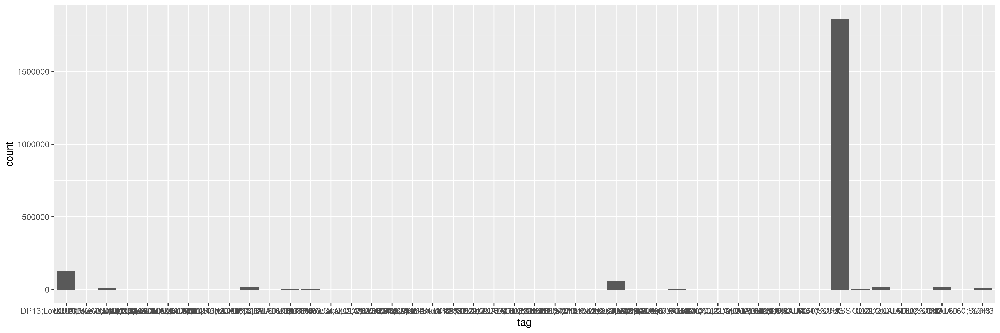
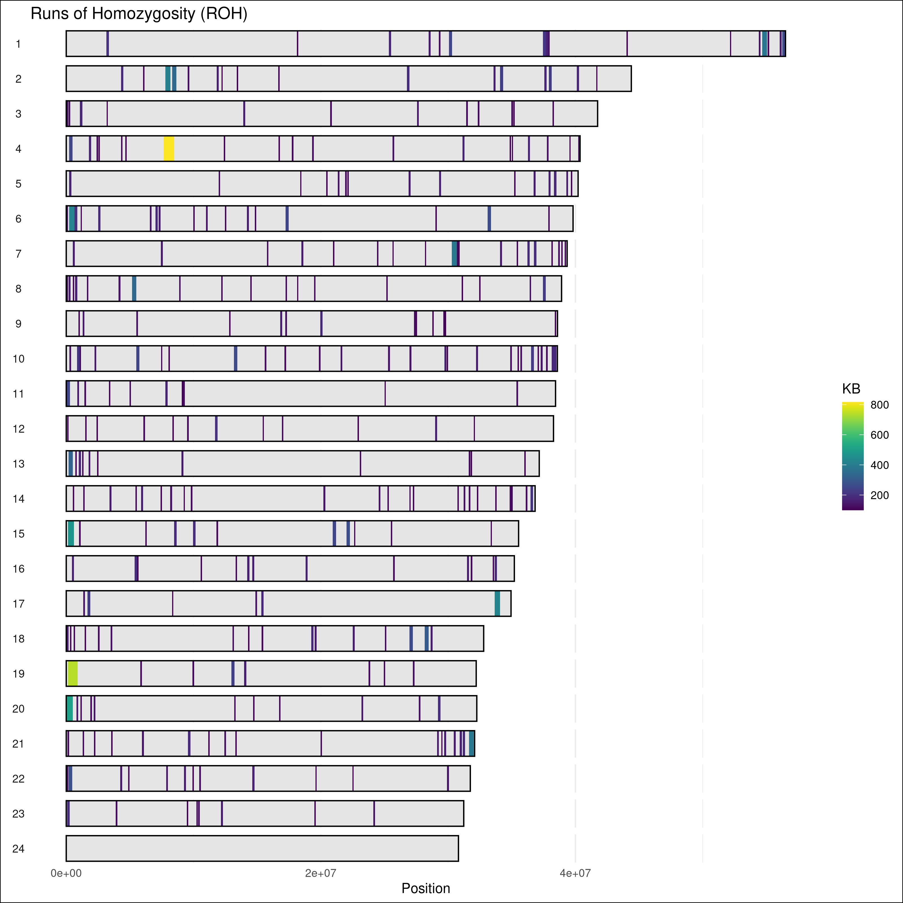

Coverage and Heterozygosity
================

# Genome-wide Coverage and Heterozygosity

\*\*\* needs to be updated with gatk4 protocols \*\*\*

Pacbio HiFi reads used to generate the reference sequence for
fAloSap1.pri were mapped back onto the reference genome with [minimap2
2.24](https://github.com/lh3/minimap2) with the `map-hifi` setting and
sorted using `samtools sort`. To investigate the degree of
heterozygosity present in the genome, we used [GATK
3.8.1](https://gatk.broadinstitute.org/hc/en-us) to perform local
realignment around indels (IndelRealigner) and for genotype calling
using HaplotypeCaller followed by GenotypeGVCFs. All sites including
both variants and invariant sites were called using the
`-ERC BP_RESOLUTION` and `-out_mode EMIT_ALL_SITES` parameters on, in
HaplotypeCaller. The parameters `-allSites` and `-stand_call_conf 0`
were on, in GenotypeGVCFs. We filtered out sites with excessively low or
high read depth (1/3X and 2X the genome-wide average, respectively).

## Coverage

<br>  
Mean coverage across the genome:

``` r
mean_cov %>% kable()
```

|       x |
|--------:|
| 36.4284 |

<br>

#### Genome-wide coverage:

Mean coverage per 50kb intervals across the genome, with mean
genome-wide coverage denoted by a red dashed line.

``` r
chrom_size <- read_tsv("../assembly/sizes.genome.ucsc", col_names = c("Chromosome", "Start", "End"))
no_cov <- cov_50kb %>% filter(mean_depth < 5)


genome_cov_plot <- cov_50kb %>%
    ggplot() +
    geom_point(aes(x = Start, y = mean_depth),
        size = 0.5
    ) +
    geom_hline(aes(yintercept = mean_cov),
        linetype = "dashed",
        color = "red",
        size = 1
    ) +
    xlab("Position") +
    ylab("Mean Coverage per 50 kb") +
    ylim(c(0, 100)) +
    facet_wrap(~`Chromosome`,
        ncol = length(chroms),
        scales = "free_x"
    ) +
    theme_classic() +
    theme(
        legend.position = "none",
        axis.text.x = element_blank(),
        panel.grid.major.x = element_blank(),
        panel.grid.minor.x = element_blank(),
        panel.grid.major.y = element_blank(),
        panel.grid.minor.y = element_blank(),
        axis.ticks.x = element_blank(),
        plot.background = element_rect(fill = "white"),
        panel.spacing.x = unit(0, "lines"),
        strip.background = element_blank(),
        strip.text.x = element_blank()
    )

genome_cov_plot
```

<br>

#### Genome-wide heterozygosity

Using 1mb windows:

``` r
# Filter out windows with < 50% genotyping rate

snp_gt_1mb_window_filtered <- snp_gt_1mb_window %>% filter(genotype_rate >= 0.5)


## Snps per kb, 1mb windows
snp_1mb_window_plot <- snp_gt_1mb_window_filtered %>%
    ggplot() +
    geom_col(
        aes(x = int_start, y = snp_kb, fill = chrom_odd),
        position = "jitter",
        width = 1000000
    ) +
    facet_wrap(
        ~`Chromosome`,
        ncol = 24,
        strip.position = "top",
        scales = "free_x"
    ) +
    ggtitle("Heterozygosity by Chromosome (1mb windows) \n fAloSap1.pri") +
    xlab("Position") +
    ylab("Heterozygosity per kb") +
    theme(
        legend.position = "none",
        axis.text.x = element_blank(),
        panel.grid.major.x = element_blank(),
        panel.grid.minor.x = element_blank(),
        panel.grid.major.y = element_blank(),
        panel.grid = element_blank(),
        axis.ticks.x = element_blank(),
        plot.background = element_rect(fill = "white"),
        panel.spacing.x = unit(0, "lines")
    ) +
    scale_fill_manual(values = c("dodgerblue4", "cornflowerblue"))

snp_1mb_window_plot
```

<!-- -->

``` r
snp_hist_1mb <- snp_gt_1mb_window %>% ggplot() +
    geom_histogram(aes(x = snp_kb),
        binwidth = 0.1,
        color = "black",
        fill = "dodgerblue4"
    ) +
    xlab("Heterozygosity") +
    ylab("# of Windows") +
    theme_classic()

snp_hist_1mb
```

<!-- -->

Using 50kb windows:

``` r
snp_gt_50kb_window_filtered <- snp_gt_50kb_window %>%
    filter(genotype_rate >= 0.5)

mean_het <- snp_gt_50kb_window_filtered %>%
    pull(snp_kb) %>%
    mean()

sd_het <- snp_gt_50kb_window_filtered %>%
    pull(snp_kb) %>%
    sd()

t_test_het <- snp_gt_50kb_window_filtered %>%
    pull(snp_kb) %>%
    t.test()

conf_int_het <- t_test_het$conf.int

snp_kb_50kb <- snp_gt_50kb_window_filtered %>%
    pull(snp_kb)

# Dashed line is mean genome-wide heterozygosity per kb
snp_window_plot_50kb <- snp_gt_50kb_window_filtered %>%
    ggplot() +
    geom_point(aes(x = int_start, y = snp_kb, color = chrom_odd),
        size = 0.5
    ) +
    geom_hline(aes(yintercept = mean(snp_kb)),
        linetype = "dashed",
        color = "red",
        size = 1
    ) +
    facet_wrap(
        ~`Chromosome`,
        ncol = 24,
        strip.position = "bottom",
        scales = "free_x"
    ) +
    xlab("") +
    ylab("Heterozygosity per kilobase") +
    theme_classic() +
    theme(
        legend.position = "none",
        axis.text.x = element_blank(),
        panel.grid.major.x = element_blank(),
        panel.grid.minor.x = element_blank(),
        panel.grid.major.y = element_blank(),
        panel.grid = element_blank(),
        axis.ticks.x = element_blank(),
        plot.background = element_rect(fill = "white"),
        panel.spacing.x = unit(0, "lines"),
        axis.title = element_text(size = 14),
        axis.text = element_text(size = 12),
    strip.background = element_blank(),
        strip.placement = "outside",
        strip.text = element_text(size = 14)
    ) +
    scale_color_manual(values = c("dodgerblue4", "cornflowerblue"))

# het_cov_plot_50kb <- plot_grid(snp_window_plot_50kb,
#     genome_cov_plot,
#     ncol = 1,
#     align = "v"
# )

snp_window_plot_50kb
```

<!-- -->

``` r
snp_hist_50kb <- snp_gt_50kb_window_filtered %>%
    ggplot() +
    geom_histogram(
        aes(x = snp_kb),
        binwidth = 0.25,
        color = "#000000",
        fill = "dodgerblue4"
    ) +
    xlab("Heterozygosity per kilobase") +
    ylab("Number of windows") +
    theme_classic() +
    theme(
        axis.title = element_text(size = 16),
        axis.text = element_text(size = 14)
    )

snp_hist_50kb
```

<!-- -->

``` r
snp_gt_50kb_window_filtered %>%
    pull(snp_kb) %>%
    mean() %>%
    kable()
```

|        x |
|---------:|
| 1.929639 |

#### FILTER tag distributions

``` r
filt <- read_tsv("../gatk4_outputs/snp_filter_tag.tsv", col_names = c("chrom", "pos", "tag"))

filt %>% ggplot(aes(x = tag)) + geom_bar()
```

<!-- -->

#### Combined coverage and heterozygosity using 50kb windows

``` r
het_cov_plot_50kb
```

#### Runs of Homozygosity (ROH)

ROH identified using the PLINK 1.9 `--homozyg` function using default
parameters except for `--homozyg-kb` set to `100` to allow for detection
of ROH \> 100kb in length.

``` r
setwd("/workdir/azwad/shad-genome")

library(viridis)

shad_roh <-
    read_table(
        "reads/plink.hom"
    ) %>% mutate(CHR = paste0("chr", CHR))

chroms <- paste0("chr", c(1:24))

chrom_sizes <-
    read_tsv("assembly/sizes.genome.ucsc",
        col_names = c("CHR", "start", "length")
    ) %>%
    select(c(CHR, length)) %>%
    filter(CHR %in% chroms) %>%
    mutate(CHR = as.integer(str_sub(CHR, 4, str_length(CHR))))

roh_plot <- shad_roh %>%
    filter(CHR %in% chroms) %>%
    mutate(CHR = as.integer(str_sub(CHR, 4, str_length(CHR)))) %>%
    ggplot() +
    geom_rect(
        data = chrom_sizes,
        aes(ymin = 0, ymax = length),
        xmin = 0,
        xmax = 1,
        col = NA,
        fill = "gray90"
    ) +
    geom_rect(
        aes(ymin = POS1, ymax = POS2, fill = KB),
        xmin = 0,
        xmax = 1,
        alpha = 1
    ) +
    geom_rect(
        data = chrom_sizes,
        aes(ymin = 0, ymax = length),
        xmin = 0,
        xmax = 1,
        col = "black",
        fill = NA
    ) +
    ylab("Position") +
    scale_fill_viridis() +
    theme_minimal() +
    theme(
        strip.text.y.left = element_text(angle = 0),
        plot.background = element_rect(fill = "white")
    ) +
    coord_flip() +
    facet_wrap(~CHR, nrow = length(chrom_sizes$CHR), strip.position = "left") +
    ggtitle("Runs of Homozygosity (ROH)")


roh_plot
```

<!-- -->

#### Heterozygosity vs Other Fish Species

``` r
het_fish <- read_csv("/local/workdir/azwad/shad-genome/markdowns/coverage_heterozgosity_files/figure-gfm/heterozygosity_fish_species.csv")

het_fish %>%
    arrange(`Heterozygosity (%)`) %>%
    mutate(`Common Name` = factor(`Common Name`, unique(`Common Name`))) %>%
    ggplot(aes(x = `Common Name`, y = `Heterozygosity (%)`, fill = Method)) +
    scale_fill_viridis_d(begin = 0, end = 0.5) +
    geom_col() +
    annotate("segment", x = 8, y = 0.37, xend = 8, yend = 0.22, linewidth = 1, arrow = arrow(length = unit(0.3, "cm"))) +
    xlab("Species") +
    coord_flip() +
    theme_classic()
```

<!-- -->
