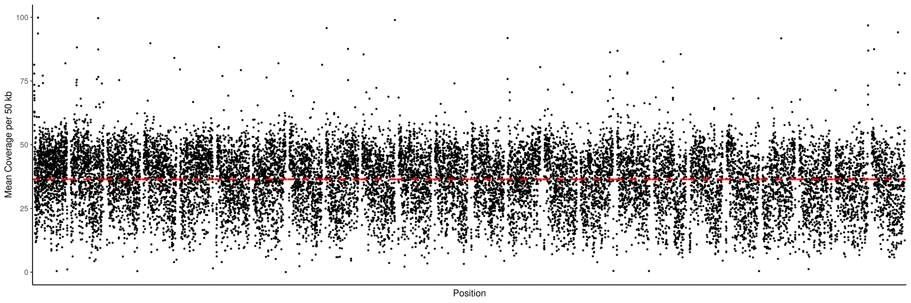
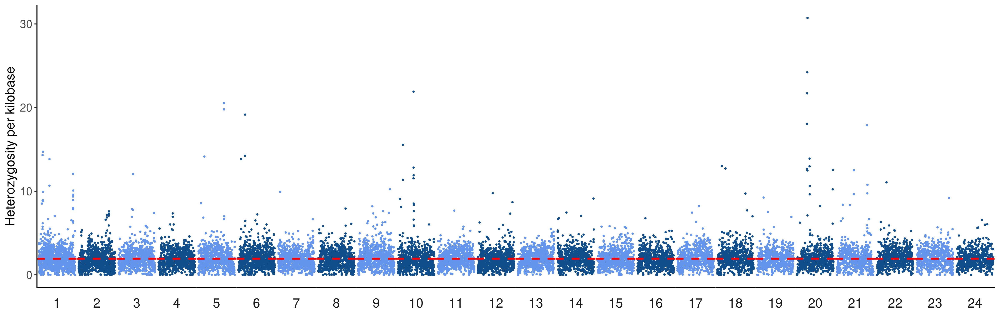
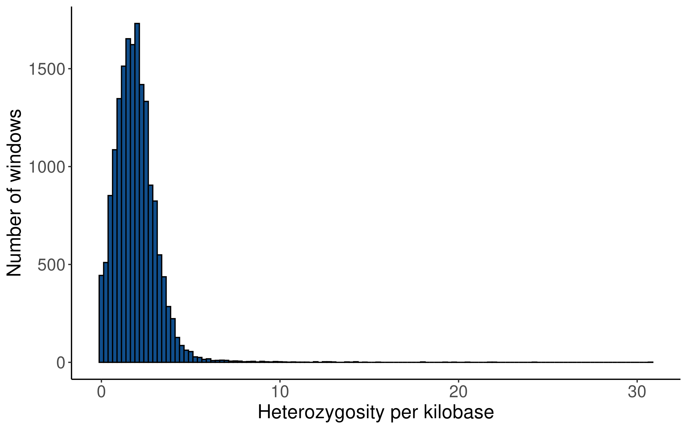

Coverage and Heterozygosity
================

# Genome-wide Coverage and Heterozygosity

Pacbio HiFi reads used to generate the reference sequence for
fAloSap1.pri were mapped back onto the reference genome with [minimap2
2.24](https://github.com/lh3/minimap2) with the `map-hifi` setting and
sorted using `samtools sort`. To investigate the degree of
heterozygosity present in the genome, [freebayes
1.3.5](https://github.com/freebayes/freebayes) was used to call variants
using default settings. The resulting VCF was filtered using `vcffilter`
to keep variants with a `QUAL` score \> 20.

## Coverage

<br>  
Mean coverage across the genome:

``` r
mean_cov %>% kable
```

|        x |
|---------:|
| 41.32937 |

<br>

#### Genome-wide coverage:

Mean coverage per 50kb intervals across the genome, with mean
genome-wide coverage denoted by a red dashed line. Regions with zero
coverage are marked in red:

``` r
chrom_size <-
  cov %>%
  group_by(Chromosome) %>%
  summarize(chrom_length = max(End)) %>%
  select(Chromosome, chrom_length)

no_cov <- cov %>% filter(Depth == 0)

cov_binned <- cov_nogaps %>%
  mutate(ints = cut_width(Position, width = 5e4, boundary = 0)) %>%
  group_by(Chromosome, ints) %>%
  summarize(mean_depth = mean(Depth),
            int_start = min(Position)) %>%
  mutate(chrom_odd = ifelse(Chromosome %% 2 == 1, "odd", "even"))

genome_cov_plot <- cov_binned %>%
  ggplot() +
  geom_point(aes(x = int_start, y = mean_depth),
             size = 0.5) +
  geom_hline(aes(yintercept = mean_cov),
             linetype = "dashed",
             color = "red",
             size = 1) +
  xlab("Position") +
  ylab("Mean Coverage per 50 kb") +
  ylim(c(0, 500)) +
  geom_rect(
    data = no_cov,
    aes(xmin = Start, xmax = End),
    ymin = 0,
    ymax = 1000,
    fill = "red",
    alpha = 1
  ) +
  facet_wrap(~ `Chromosome`,
             ncol = length(chroms),
             scales = "free_x") +
  theme(
    legend.position = "none",
    axis.text.x = element_blank(),
    panel.grid.major.x = element_blank(),
    panel.grid.minor.x = element_blank(),
    panel.grid.major.y = element_blank(),
    panel.grid.minor.y = element_blank(),
    axis.ticks.x = element_blank(),
    plot.background = element_rect(fill = "white"),
    panel.spacing.x = unit(0, "lines"),
    strip.background = element_blank(),
    strip.text.x = element_blank()
  )

genome_cov_plot
```

<!-- -->
<br>

#### Genome-wide heterozygosity

Using 1mb windows:

``` r
# Break SNPs into 1mb windows
snp_1mb_window <- snps_filtered %>%
  mutate(ints = cut_width(End, width = 1e6, boundary = 0)) %>%
  group_by(Chromosome, ints) %>%
  summarize(snp_per_kb = n() / (1e6 / 1e3),
            int_start = min(End)) %>%
  mutate(chrom_odd = ifelse(Chromosome %% 2 == 1, "odd", "even"))


## Snps per kb, 1mb windows
snp_window_plot <- snp_1mb_window %>%
  ggplot() +
  geom_col(
    aes(x = int_start, y = snp_per_kb, fill = chrom_odd),
    position = "jitter",
    width = 1000000
  ) +
  facet_wrap(
    ~ `Chromosome`,
    ncol = 24,
    strip.position = "top",
    scales = "free_x"
  ) +
  ggtitle("Heterozygosity by Chromosome (1mb windows) \n fAloSap1.pri") +
  xlab("Position") +
  ylab("Heterozygosity per kb") +
  theme(
    legend.position = "none",
    axis.text.x = element_blank(),
    panel.grid.major.x = element_blank(),
    panel.grid.minor.x = element_blank(),
    panel.grid.major.y = element_blank(),
    panel.grid = element_blank(),
    axis.ticks.x = element_blank(),
    plot.background = element_rect(fill = "white"),
    panel.spacing.x = unit(0, "lines")
  ) +
  scale_fill_manual(values = c("dodgerblue4", "cornflowerblue"))

snp_window_plot
```

<!-- -->

Using 50kb windows, with genome-wide:

``` r
snp_50kb_window <- snps_filtered %>%
  mutate(ints = cut_width(End, width = 5e4, boundary = 0)) %>%
  group_by(Chromosome, ints) %>%
  summarize(snp_per_kb = n() / (5e4 / 1e3),
            int_start = min(End)) %>%
  mutate(chrom_odd = ifelse(Chromosome %% 2 == 1, "odd", "even"))

# Dashed line is mean genome-wide heterozygosity per kb
snp_window_plot_50kb <- snp_50kb_window %>%
  ggplot() +
  geom_point(aes(x = int_start, y = snp_per_kb, color = chrom_odd),
             size = 0.5) +
  geom_hline(aes(yintercept = nrow(snps_filtered) / ((nrow(cov_nogaps) - sum(no_cov$End - no_cov$Start)) / 1000)),
             linetype = "dashed",
             color = "red",
             size = 1) +
  facet_wrap(
    ~ `Chromosome`,
    ncol = 24,
    strip.position = "top",
    scales = "free_x"
  ) +
  ggtitle("Heterozygosity by Chromosome (50kb windows) \n fAloSap1.pri") +
  xlab("") +
  ylab("Heterozygosity per kb") +
  theme(
    legend.position = "none",
    axis.text.x = element_blank(),
    panel.grid.major.x = element_blank(),
    panel.grid.minor.x = element_blank(),
    panel.grid.major.y = element_blank(),
    panel.grid = element_blank(),
    axis.ticks.x = element_blank(),
    plot.background = element_rect(fill = "white"),
    panel.spacing.x = unit(0, "lines")
  ) +
  scale_color_manual(values = c("dodgerblue4", "cornflowerblue"))

het_cov_plot_50kb <- plot_grid(snp_window_plot_50kb,
                               genome_cov_plot,
                               ncol = 1,
                               align = "v")

snp_window_plot_50kb
```

<!-- -->

#### Combined coverage and heterozygosity using 50kb windows

``` r
het_cov_plot_50kb
```

<!-- -->
