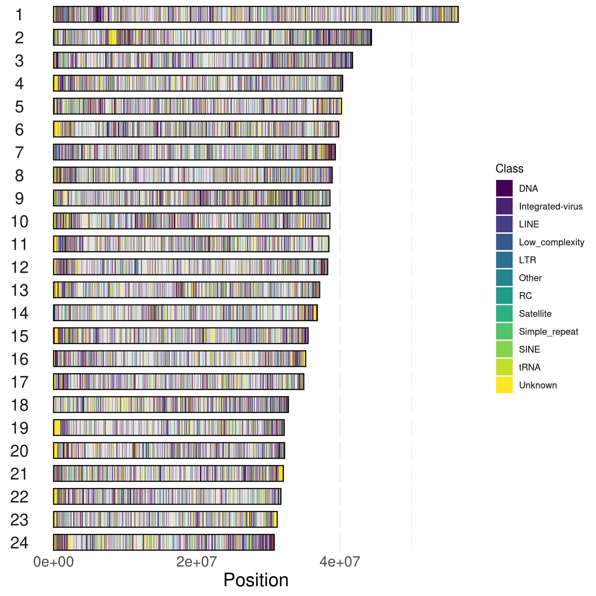
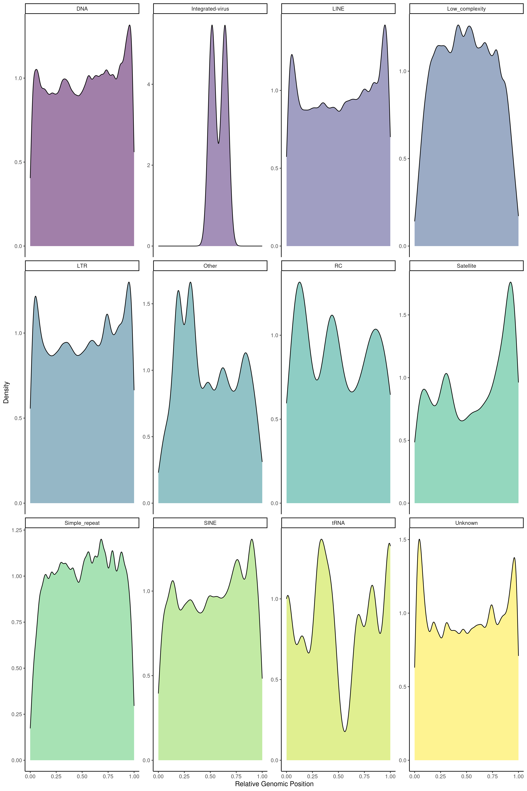
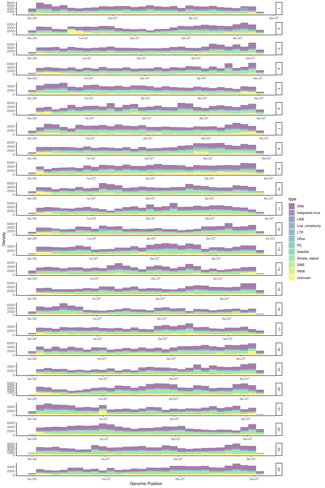
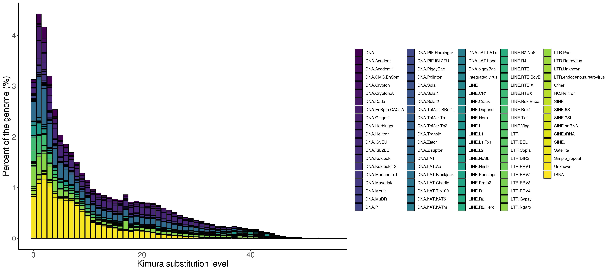

Repetitive Regions
================

# Annotating Repetitive Regions

Pacbio HiFi reads used to generate the reference sequence for
fAloSap1.pri were mapped back onto the reference genome with [minimap2
2.24](https://github.com/lh3/minimap2) with the `map-hifi` setting and
sorted using `samtools sort`. To annotate the repetitive regions in the
genome, [RepeatModeler
(v2.0.1)](http://www.repeatmasker.org/RepeatModeler/) was used to build
a repeat library for the American shad genome employing the
[Repbase](https://www.girinst.org/repbase/) database using the latest
version 28.04 (04/27/2023). The repeat consensus database was then
filtered for known protein sequences with uniref90 (known transposases
provided with Repeatmasker were pre-removed from the uniref90 database).
The remaining repeat database was then classified with Repbase, and used
to generate a repeat annotation gff file using RepeatMasker (Methods
adapted from [Stanhope et
al. 2022](https://www.ncbi.nlm.nih.gov/pmc/articles/PMC9826928/)) and
provided by the Cornell BioHPC User Guide for
[RepeatModeler](https://biohpc.cornell.edu/lab/userguide.aspx?a=software&i=259#c)
and
[RepeatMasker](https://biohpc.cornell.edu/lab/userguide.aspx?a=software&i=62#c).

The repeat sequences in the genome assembly was soft masked with
RepeatMasker (version 4.1.0), using the repeat library created by
combining the Repbase database (latest version 10/26/2018) with de novo
TEs identified by RepeatModeler.

#### Summary of repetitive regions in the assembly

#### Genome-wide distribution of repetitive regions

``` r
setwd("/workdir/azwad/shad-genome")

shad_repeats <-
    read_tsv(
        "repeats/genome_mask/fAloSap1_repeats.out",
        col_names = c("chrom", "start", "end", "type")
    ) %>% mutate(type = gsub("\\/.*", "", type), type = ifelse(type == "SINE?", "SINE", type))

chroms <- paste0("chr", c(1:24))

chrom_sizes <-
    read_tsv("assembly/sizes.genome.ucsc",
        col_names = c("chrom", "start", "length")
    ) %>%
    select(c(chrom, length)) %>%
    filter(chrom %in% chroms) %>%
    mutate(chrom = as.integer(str_sub(chrom, 4, str_length(chrom))))

repeat_plot <- shad_repeats %>%
    filter(chrom %in% chroms) %>%
    mutate(chrom = as.integer(str_sub(chrom, 4, str_length(chrom)))) %>%
    ggplot() +
    geom_rect(
        data = chrom_sizes,
        aes(ymin = 0, ymax = length),
        xmin = 0,
        xmax = 1,
        col = NA,
        fill = "gray90"
    ) +
    geom_rect(
        aes(ymin = start, ymax = end, fill = type),
        xmin = 0,
        xmax = 1,
        alpha = 1
    ) +
    geom_rect(
        data = chrom_sizes,
        aes(ymin = 0, ymax = length),
        xmin = 0,
        xmax = 1,
        col = "black",
        fill = NA
    ) +
    ylab("Position") +
    scale_fill_viridis(discrete = TRUE) +
    theme_minimal() +
    theme(
        strip.text.y.left = element_text(angle = 0),
        plot.background = element_rect(fill = "white")
    ) +
    coord_flip() +
    facet_wrap(~`chrom`, nrow = length(chroms), strip.position = "left")


repeat_plot
```

<!-- -->

``` r
# Are particular types of repeats concentrated towards ends of genomes?
shad_repeats %>%
    filter(chrom %in% chroms) %>%
    mutate(chrom = as.integer(str_sub(chrom, 4, str_length(chrom)))) %>%
    left_join(chrom_sizes) %>%
    mutate(dist_end = length - end) %>%
    group_by(type) %>%
    summarize(mean_dist_end = mean(dist_end), mean_start = mean(start)) %>%
    arrange(mean_dist_end, mean_start) %>%
    kable()
```

| type             | mean_dist_end | mean_start |
|:-----------------|--------------:|-----------:|
| Integrated-virus |      15352436 |   20443371 |
| Satellite        |      16565715 |   21445148 |
| tRNA             |      18060096 |   18873431 |
| Simple_repeat    |      18158667 |   19486921 |
| SINE             |      18171647 |   19807741 |
| DNA              |      18289747 |   19659708 |
| LINE             |      18517506 |   19863749 |
| LTR              |      18602237 |   19651570 |
| Low_complexity   |      18890721 |   18798829 |
| Unknown          |      19022824 |   19292107 |
| Other            |      19182599 |   18352308 |
| RC               |      20351481 |   18414105 |

<br>

#### Separating repeats by type to identify any spacial patterns of distribution on the genome

``` r
shad_repeats %>%
    filter(chrom %in% chroms) %>%
    mutate(chrom = as.integer(str_sub(chrom, 4, str_length(chrom)))) %>%
    left_join(chrom_sizes) %>%
    mutate(relative_pos = ((end + start) / 2) / length) %>%
    ggplot() +
    geom_density(aes(x = relative_pos, fill = type), alpha = 0.5) +
    scale_fill_viridis(discrete = TRUE) +
    facet_wrap(~type, scales = "free_y") +
    ylab("Density") +
    xlab("Relative Genomic Position") +
    theme_classic() +
    theme(legend.position = "none")
```

<!-- -->

``` r
shad_repeats %>%
    filter(chrom %in% chroms) %>%
    mutate(chrom = as.integer(str_sub(chrom, 4, str_length(chrom)))) %>%
    ggplot() +
    geom_histogram(aes(x = start, fill = type), alpha = 0.5) +
    scale_fill_viridis(discrete = TRUE) +
    facet_wrap(~chrom, scales = "free", nrow = length(chroms), strip.position = "right") +
    ylab("Density") +
    xlab("Genomic Position") +
    theme_classic()
```

<!-- -->

#### Composition of Repetitive Elements

``` r
## Code from Kristina Galagova; See: https://github.com/oushujun/EDTA/issues/92
setwd("/workdir/azwad/shad-genome")
KimuraDistance <- read.csv("repeats/genome_mask_2/GCF_018492685.fa.distance", sep = " ")

# add here the genome size in bp
genomes_size <- 903581644

kd_melt <- melt(KimuraDistance, id = "Div")
kd_melt$norm <- kd_melt$value / genomes_size * 100

ggplot(kd_melt, aes(fill = variable, y = norm, x = Div)) +
    geom_bar(position = "stack", stat = "identity", color = "black") +
    scale_fill_viridis(discrete = T) +
    theme_classic() +
    xlab("Kimura substitution level") +
    ylab("Percent of the genome (%)") +
    labs(fill = "") +
    coord_cartesian(xlim = c(0, 55)) +
    theme(axis.text = element_text(size = 11), axis.title = element_text(size = 12))
```

<!-- -->
